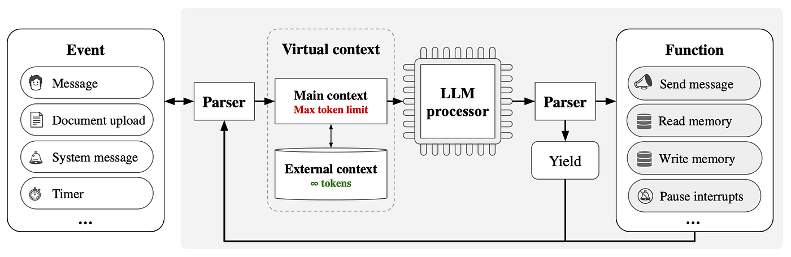

# Kaashvi — Project Notes

These are detailed explanations of how Kaashvi works, what each component does, and the engineering principles behind the project.

## What Kaashvi Is

Kaashvi is a personal AI assistant that runs locally on my computer. It is built from scratch using Python and the Anthropic API with no frameworks like LangChain. Kaashvi is also a Hindu name meaning bright, shining and radiant.

The goal of this project is to read AI research papers one by one, understand the concepts deeply, and then implement them into Kaashvi. Each paper adds a new capability to the agent. This is not just a coding project, it is a learning journey through the foundations of modern AI.

## What Kaashvi Can Do Right Now

Kaashvi has 24 tools across 9 categories. She can manage Google Calendar (create, list, delete events, find free time), send and search Gmail, create and search Notion pages, remember context across conversations (MemGPT), search the web (DuckDuckGo), check weather (wttr.in), read/write/list files, manage tasks and reminders (persistent JSON), and run shell commands (with safety blocklist). She runs as a CLI tool or as a desktop app through Electron with a custom pink cat mascot UI.

## Architecture

```
User Input
    |
    v
main.py (CLI or Electron entry point)
    |
    v
agent/react_loop.py (ReAct loop engine)
    |
    +--> build_system_prompt()      [System Instructions]
    +--> conversation_history       [Conversational Context]
    +--> scratchpad                 [Working Context]
    +--> count_tokens()             [Token Awareness]
    +--> trim_history()             [FIFO Eviction + Archiving]
    |
    v
agent/tools.py (Tool Registry, 24 tools)
    |
    +--> EchoTool                   [Testing]
    +--> CreateEventTool            [Google Calendar]
    +--> ListEventsTool             [Google Calendar]
    +--> DeleteEventTool            [Google Calendar]
    +--> FindFreeTimeTool           [Google Calendar]
    +--> NotionCreatePageTool       [Notion]
    +--> NotionSearchTool           [Notion]
    +--> SearchMemoryTool           [MemGPT Memory]
    +--> GmailSendTool              [Gmail]
    +--> GmailReadTool              [Gmail]
    +--> GmailSearchTool            [Gmail]
    +--> WebSearchTool              [DuckDuckGo]
    +--> WeatherTool                [wttr.in]
    +--> ReadFileTool               [File System]
    +--> WriteFileTool              [File System]
    +--> ListFilesTool              [File System]
    +--> SetReminderTool            [Reminders]
    +--> ListRemindersTool          [Reminders]
    +--> CheckRemindersTool         [Reminders]
    +--> AddTaskTool                [Tasks]
    +--> ListTasksTool              [Tasks]
    +--> CompleteTaskTool           [Tasks]
    +--> DeleteTaskTool             [Tasks]
    +--> RunCommandTool             [Shell]
```

## How ReAct Works (Yao 2023)

Kaashvi is built on the ReAct paper which introduces the idea of combining reasoning and acting in a single loop. Most AI systems either think without doing anything, or use tools without explaining why. ReAct does both together. The agent produces a Thought (why it wants to do something), then an Action (which tool to call), then receives an Observation (the result from that tool), and repeats this cycle until it has a final answer. In my code, this loop lives in agent/react_loop.py inside the run_agent() function. The scratchpad variable accumulates each Thought/Action/Observation step so the LLM can see its own reasoning history while solving one task.

## How MemGPT Works (Packer 2023)

The ReAct loop gives Kaashvi memory within a single task, but it had no memory across multiple turns of conversation. If you asked Kaashvi to create a movie event and then said "make it at 7pm", she would have no idea what "it" referred to because every call to run_agent() started with a blank message list. MemGPT introduces the concept of memory tiers, inspired by how computers have RAM for fast temporary storage and a hard drive for long term permanent storage. The LLM's context window acts like RAM, it can only hold so much at once. I implemented this by keeping conversation history in a list and passing all previous messages to the LLM on every turn, so Kaashvi remembers what was discussed earlier. When the history gets too long, old messages are evicted using a FIFO (First In First Out) policy and archived to a JSON file. Kaashvi can then search through archived conversations using the SearchMemoryTool, enabling multi hop retrieval across long conversation histories.



Three types of context in MemGPT that map to Kaashvi:

1. System Instructions (Read Only): The build_system_prompt() function in react_loop.py. These are the base instructions telling the LLM who it is, what tools it has, and how to format its responses.

2. Conversational Context (Read Only, FIFO eviction): The conversation_history list. Recent messages between user and assistant. When it gets too long, the oldest messages are archived to memory_archive.json using trim_history() and can be searched later.

3. Working Context (Writable by LLM): The scratchpad variable. The agent fills it with Thought/Action/Observation traces while solving one task. It grows with each iteration of the ReAct loop.

MemGPT evaluates memory on two criteria. Consistency measures whether the agent remembers facts and preferences from past interactions. Engagingness measures whether the agent uses memory to personalize responses. Kaashvi passes both: she remembers facts like friend names and preferences across turns, and uses them naturally when creating calendar events or answering questions.

## Project Structure

```
kaashvi/
    agent/
        react_loop.py           Core ReAct loop, token counting, history trimming, API retry
        tools.py                Tool base class and registry (24 tools)
    integrations/
        google_auth.py          Google OAuth2 authentication (Calendar + Gmail scopes)
        calendar_tools.py       Google Calendar tools (4 tools)
        gmail_tools.py          Gmail tools — send, read, search (3 tools)
        notion_tools.py         Notion tools (2 tools)
        memory_tools.py         SearchMemoryTool for archived conversations
        web_search_tools.py     DuckDuckGo web search (1 tool)
        weather_tools.py        Weather via wttr.in (1 tool)
        file_tools.py           Read, write, list files with path safety (3 tools)
        reminder_tools.py       Set, list, check reminders — reminders.json (3 tools)
        task_tools.py           Add, list, complete, delete tasks — tasks.json (4 tools)
        shell_tools.py          Run shell commands with blocklist safety (1 tool)
    desktop/
        main.js                 Electron main process
        preload.js              IPC bridge
        index.html              Chat UI (pink purple theme, cat mascot)
    docs/
        project-notes.md        This file. Detailed explanations of how everything works.
        react-paper.md          Deep dive into ReAct implementation
        memgpt-paper.md         Deep dive into MemGPT implementation
    main.py                     Entry point (CLI mode + Electron mode + startup reminder check)
    tasks.json                  Persistent task storage (auto-created)
    reminders.json              Persistent reminder storage (auto-created)
```

## Engineering Principles

### Red Green Refactor (TDD)

1. RED: Write a test that defines the expected behavior, run it, watch it fail because the feature does not exist yet.
2. GREEN: Write the minimum implementation code needed to make that failing test pass, nothing more.
3. REFACTOR: Clean up the code (remove duplication, improve naming) while re running the test to ensure it still passes.

## Setup

Requires Python 3.10+, an Anthropic API key, Google Calendar API credentials, and a Notion integration token. Create a .env file with your API keys and run main.py to start the CLI, or cd into desktop/ and run npm start for the Electron app.

---

## Session Log

### 2026-04-20 — 16 New Tools (8 → 24 total)

**What was built:**

Expanded Kaashvi from 8 tools to 24 tools in one session. Added 7 new integration files covering Gmail, web search, weather, file management, reminders, tasks, and shell commands.

**Files created (7):**
| File | Tools | Description |
|------|-------|-------------|
| `integrations/gmail_tools.py` | gmail_send, gmail_read, gmail_search | Gmail API — send, read inbox, search |
| `integrations/web_search_tools.py` | web_search | DuckDuckGo search, no API key needed |
| `integrations/weather_tools.py` | get_weather | wttr.in free weather API |
| `integrations/file_tools.py` | read_file, write_file, list_files | File ops with home-dir path safety |
| `integrations/reminder_tools.py` | set_reminder, list_reminders, check_reminders | Persistent reminders (reminders.json) |
| `integrations/task_tools.py` | add_task, list_tasks, complete_task, delete_task | Persistent to-do list (tasks.json) |
| `integrations/shell_tools.py` | run_command | Shell exec with dangerous-command blocklist |

**Files modified (3):**
| File | Change |
|------|--------|
| `integrations/google_auth.py` | Extracted `_get_creds()`, added Gmail scopes, added `get_gmail_service()` |
| `agent/tools.py` | Imported + registered all 16 new tools (8 → 24 total) |
| `main.py` | Added `check_reminders` at startup of interactive mode |

**Bug fix:**
| File | Fix |
|------|-----|
| `agent/react_loop.py` | Added retry logic (3 attempts, exponential backoff) for Anthropic API `overloaded_error` |

**Dependencies added:** `pip install duckduckgo-search requests`

**Google re-auth:** Deleted `token.pickle` to re-authorize with new Gmail scopes (gmail.send, gmail.readonly). One-time setup.

**Safety features:**
- File tools: all paths resolved with `os.path.realpath()`, must be within user home directory
- Shell tool: blocklist prevents rm, del, format, shutdown, kill, etc. 30s timeout. Output truncated at 3000 chars.
- Reminders/tasks: stored as JSON in project root, persist across sessions

**Tested and working:**
- Task tools: add/list/complete/delete cycle verified (tasks.json created correctly)
- Reminder tools: set/list/check cycle verified (reminders.json created correctly)
- Shell tool: `python --version` returns output, `rm -rf /` correctly blocked
- File tools: reads files, lists directories, path traversal protection confirmed
- Calendar: re-authed with Gmail scopes, reads events successfully
- All 10 files pass Python syntax check

**Not yet tested (need live API):**
- Gmail send/read/search (auth working, need to test actual email ops)
- Web search (needs `duckduckgo-search` runtime test)
- Weather (needs network test with wttr.in)

**Total tool count: 24**
| Category | Tools | Count |
|----------|-------|-------|
| Calendar | create, list, delete, find_free_time | 4 |
| Gmail | send, read, search | 3 |
| Notion | create_page, search | 2 |
| Memory | search_memory | 1 |
| Web Search | web_search | 1 |
| Weather | get_weather | 1 |
| File System | read_file, write_file, list_files | 3 |
| Reminders | set, list, check | 3 |
| Tasks | add, list, complete, delete | 4 |
| Shell | run_command | 1 |
| Testing | echo | 1 |
| **Total** | | **24** |
